# SpendSmart

Ứng dụng desktop **quản lý thu chi cá nhân**, viết bằng **WPF (.NET 10)** theo kiến trúc **MVVM**, lưu dữ liệu bằng **Entity Framework Core (Code First)** trên **SQL Server LocalDB**.

## Tính năng chính

- **Đăng ký / Đăng nhập**: quản lý tài khoản bằng email + mật khẩu. Khi đăng ký, hệ thống tự động tạo sẵn 15 danh mục mặc định (10 danh mục Chi tiêu, 5 danh mục Thu nhập).
- **Nhập giao dịch**: thêm/sửa/xóa khoản thu hoặc chi, chọn danh mục, ngày, số tiền, ghi chú.
- **Lịch sử giao dịch**: xem theo từng tháng, nhóm theo ngày, hiển thị tổng thu / tổng chi / số dư.
- **Báo cáo**: biểu đồ tròn (Pie Chart) theo danh mục cho từng tháng, tách riêng Thu nhập và Chi tiêu, kèm tỷ lệ phần trăm.
- **Quản lý danh mục**: thêm/sửa/xóa danh mục, chọn icon và màu sắc; không cho xóa hoặc đổi loại danh mục nếu đã có giao dịch gắn với nó.
- **Ngân sách**: đặt hạn mức chi tiêu theo tháng cho tổng chi tiêu hoặc theo từng danh mục, cảnh báo khi gần hoặc vượt hạn mức đã đặt và **dự đoán chi tiêu tháng tới** bằng trung bình cộng chi tiêu thực tế của 3 tháng gần nhất.

## Ảnh giao diện

| Đăng nhập | Đăng ký | Trang chủ |
|:---------:|:--------:|:---------:|
| 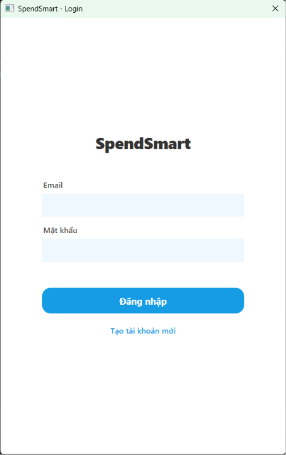 | 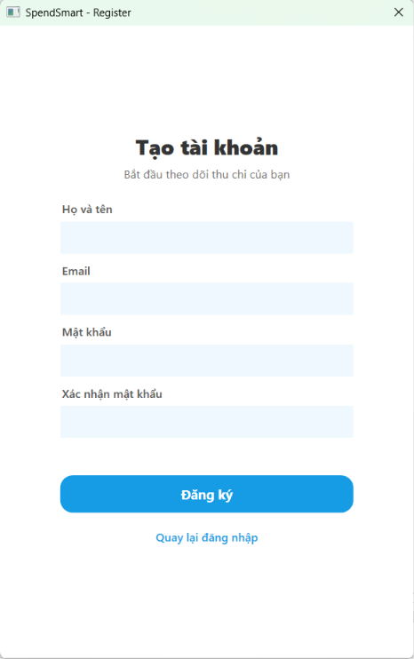 | 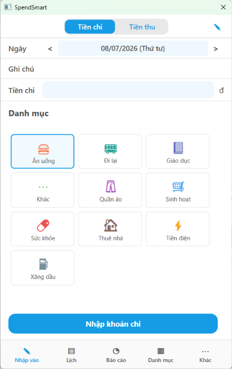 |

| Nhập giao dịch | Sửa giao dịch | Lịch sử |
|:--------------:|:-------------:|:-------:|
| 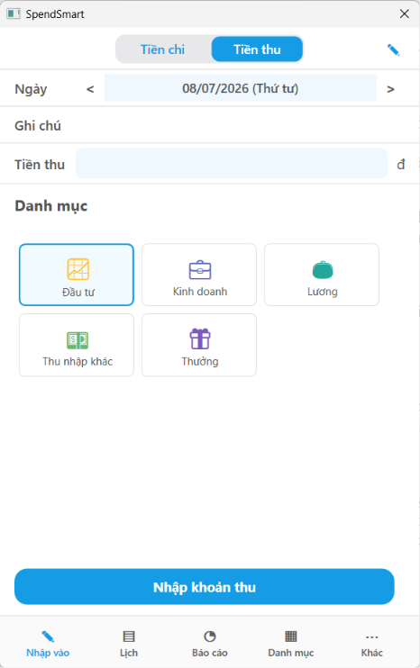 | 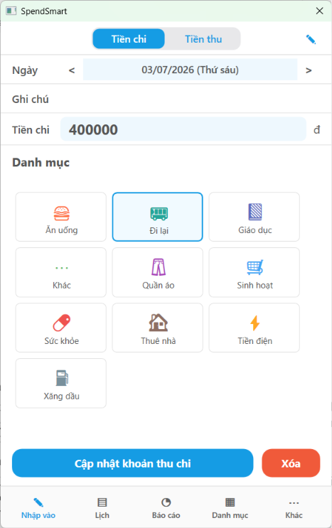 | 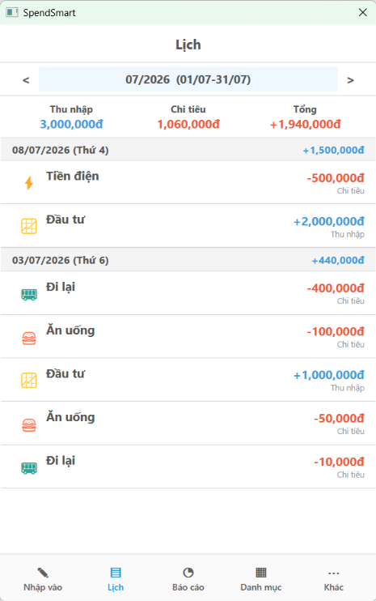 |

| Danh mục | Thêm danh mục | Sửa danh mục |
|:--------:|:-------------:|:------------:|
| 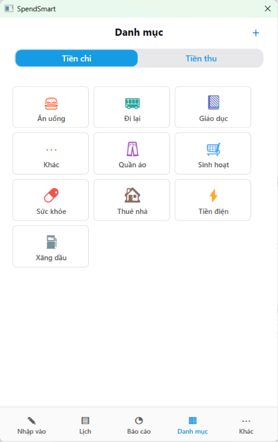 | 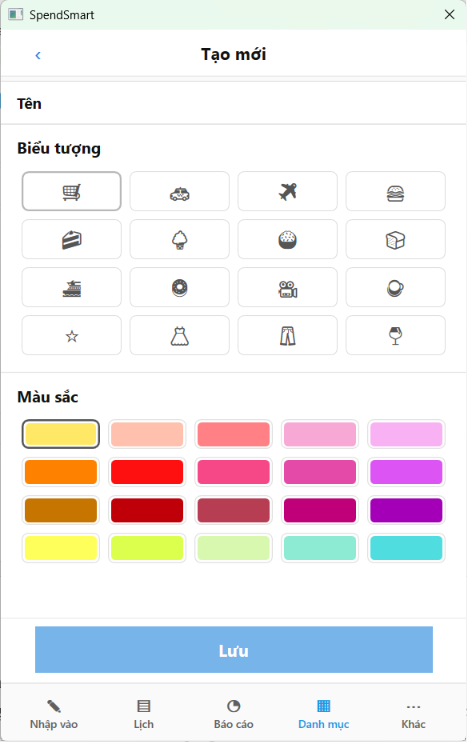 | 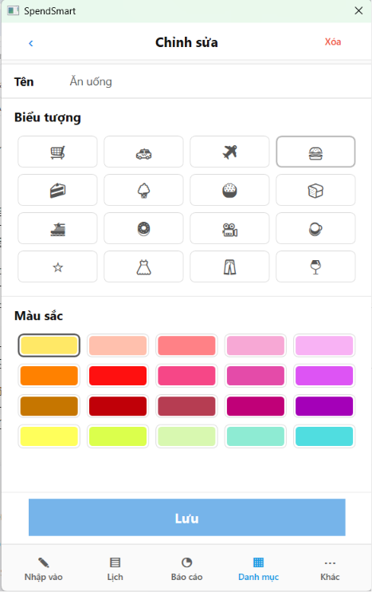 |

| Báo cáo | Ngân sách | Khác | Giới thiệu |
|:--------:|:---------:|:----:|:----------:|
| 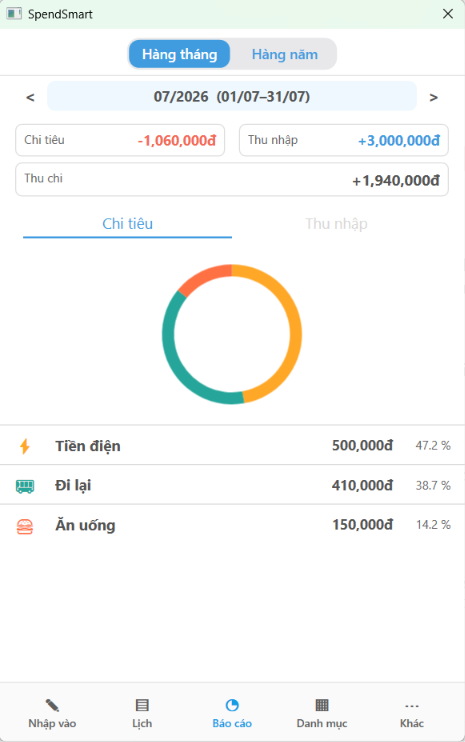 | 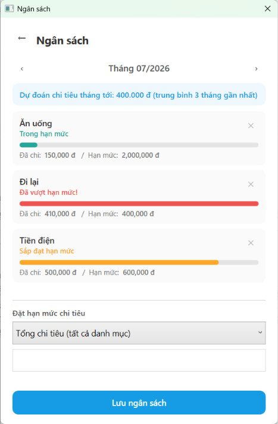 | 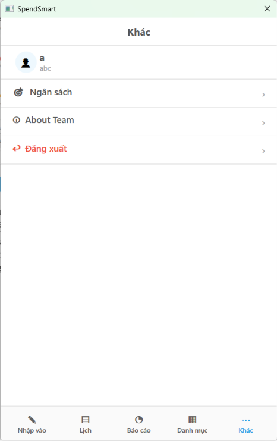 | 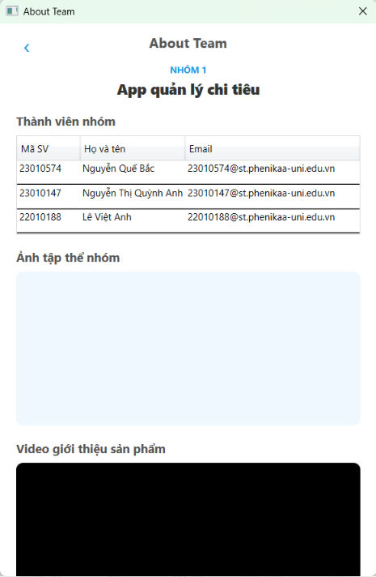 |


## Công nghệ sử dụng

| Thành phần | Công nghệ |
|---|---|
| Nền tảng | WPF, .NET 10 (`net10.0-windows`) |
| Ngôn ngữ | C# |
| Kiến trúc | MVVM (tự viết `BaseViewModel`, `RelayCommand`, không dùng framework MVVM ngoài) |
| ORM | Entity Framework Core 10 (Code First + Migrations) |
| Cơ sở dữ liệu | SQL Server LocalDB |
| Biểu đồ | LiveChartsCore.SkiaSharpView.WPF |

## Cấu trúc thư mục

```
spendsmart/
├── Models/              # User, Category, Transaction, Budget
├── Data/                # AppDbContext (cấu hình EF Core)
├── Migrations/          # EF Core Migrations
├── Resources/           # Chứa hình ảnh, icon và tài nguyên giao diện.
├── Services/             # Tầng nghiệp vụ: AuthService, CategoryService,
│                         # TransactionService, BudgetService, ReportService,
│                         # ApplicationState (phiên đăng nhập), ServiceFactory (khởi tạo service)
├── ViewModels/           # MVVM ViewModel cho từng màn hình
├── Views/                # Giao diện XAML (Login, Register, Main, Input,
│                         # History, Report, CategoryManagement, Budget, More, About)
├── Converters/           # IValueConverter dùng trong XAML binding
├── Constants/            # TransactionTypes (Income/Expense)
├── App.xaml / App.xaml.cs      # Khởi chạy ứng dụng WPF
└── spendsmart.csproj           # Tệp cấu hình project (.NET 10, WPF, EF Core, LiveCharts)
```

## Cơ sở dữ liệu (ERD)

4 bảng: `User`, `Category`, `Transaction`, `Budget`.

- `User` 1—n `Category` (xóa User → xóa luôn Category, `Cascade`)
- `User` 1—n `Transaction` (không cho xóa User nếu còn Transaction, `Restrict`)
- `User` 1—n `Budget` (`Cascade`)
- `Category` 1—n `Transaction` (không cho xóa/đổi loại Category nếu còn Transaction, `Restrict`)
- `Category` 1—n `Budget`, quan hệ **tùy chọn** (`CategoryId` có thể null = ngân sách tổng cho toàn bộ chi tiêu)

Ràng buộc Unique:
- `User.Email`
- `Category (UserId, Type, Name)` — không trùng tên danh mục trong cùng loại Thu/Chi của cùng một user
- `Budget (UserId, CategoryId, Year, Month)` — mỗi user chỉ có một ngân sách cho một danh mục/tháng/năm


## Yêu cầu môi trường

- Windows (WPF chỉ chạy trên Windows)
- [.NET 10 SDK](https://dotnet.microsoft.com/) trở lên
- SQL Server LocalDB (thường có sẵn khi cài Visual Studio, hoặc cài riêng qua SQL Server Express LocalDB)
- Visual Studio 2022+ (khuyến nghị) hoặc `dotnet` CLI

## Cách chạy dự án

1. Clone repository và mở file `spendsmart.slnx` bằng Visual Studio, **hoặc** chạy bằng CLI:
   ```bash
   git clone <repo-url>
   cd SpendSmart-main/spendsmart
   dotnet restore
   dotnet run
   ```
2. Không cần tạo database thủ công — khi ứng dụng khởi động, `App.xaml.cs` sẽ tự động gọi `dbContext.Database.Migrate()` để tạo/cập nhật database `SpendSmartDb` trên LocalDB theo các migration có sẵn trong thư mục `Migrations/`.
3. Chuỗi kết nối mặc định (cấu hình trong `Data/AppDbContext.cs`):
   ```
   Server=(localdb)\MSSQLLocalDB;Database=SpendSmartDb;Trusted_Connection=True;TrustServerCertificate=True;
   ```
   Nếu máy không có instance `(localdb)\MSSQLLocalDB`, cần cài SQL Server LocalDB hoặc chỉnh lại chuỗi kết nối cho phù hợp.
4. Đăng ký tài khoản mới ở màn hình đầu tiên để bắt đầu sử dụng (danh mục mặc định sẽ được tạo tự động).

## Ghi chú / hạn chế hiện tại

- Mật khẩu hiện đang được lưu dạng **plain text** trong bảng `User` — đây là điểm cần cải thiện trong hướng phát triển tiếp theo (băm mật khẩu bằng BCrypt/PBKDF2 trước khi lưu).
- Chưa có chức năng xuất báo cáo ra file (Excel/PDF).
- Chưa hỗ trợ đồng bộ dữ liệu qua cloud/nhiều thiết bị — dữ liệu chỉ lưu cục bộ trên LocalDB của máy đang chạy.

## Hướng phát triển

- Mã hóa mật khẩu người dùng.
- Xuất báo cáo thu chi ra Excel/PDF.
- Đồng bộ hoặc sao lưu dữ liệu qua cloud.
